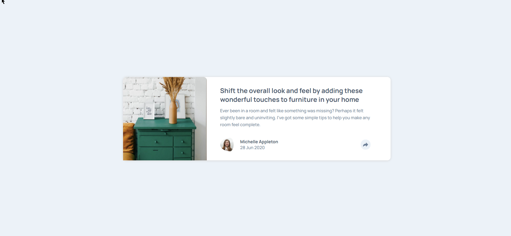

# Frontend Mentor - Article preview component solution

This is a solution to the [Article preview component challenge on Frontend Mentor](https://www.frontendmentor.io/challenges/article-preview-component-dYBN_pYFT). Frontend Mentor challenges help you improve your coding skills by building realistic projects.

## Table of contents

-   [Overview](#overview)
    -   [The challenge](#the-challenge)
    -   [Screenshot](#screenshot)
    -   [Links](#links)
-   [My process](#my-process)
    -   [Built with](#built-with)
    -   [What I learned](#what-i-learned)
-   [Author](#author)

## Overview

### The challenge

Users should be able to:

-   View the optimal layout for the component depending on their device's screen size
-   See the social media share links when they click the share icon

### Screenshot

### Links

-   Solution URL: [Frontend Mentor Solution](https://www.frontendmentor.io/solutions/mobile-first-article-preview-component-I_ULZ6gEa)
-   Live Site URL: [Netlify Live Site](https://crimson-article-preview.netlify.app/)

## My process

### Built with

-   Semantic HTML5 markup
-   CSS custom properties
-   Flexbox
-   Mobile-first workflow
-   Resilient web design

### What I learned

Tooltip css
selector::after {
content: "";
position: absolute;
top: 100%;
left: 50%;
border-width: 10px;
border-style: solid;
margin-left: -10px;
border-color: var(--Very-Dark-Grayish-Blue) transparent transparent;
}

## Author

-   Website - [Vaideeswaran C](https://www.vaideeswaranc.com)
-   Frontend Mentor - [@vaideeswaran23](https://www.frontendmentor.io/profile/vaideeswaran23)
-   Twitter - [@vaideeswaran23](https://www.twitter.com/vaideeswaran23)
